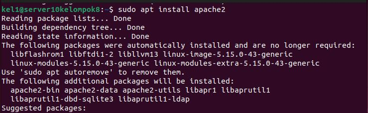
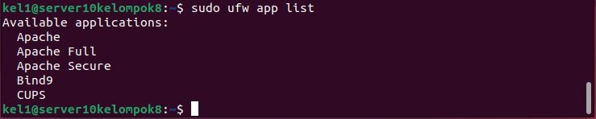
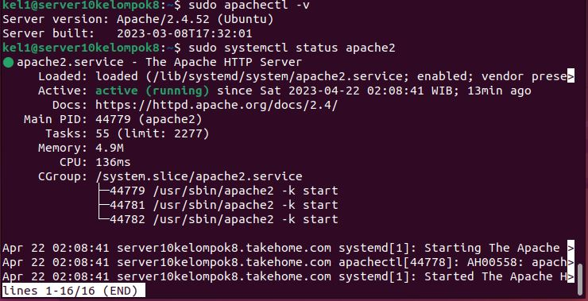
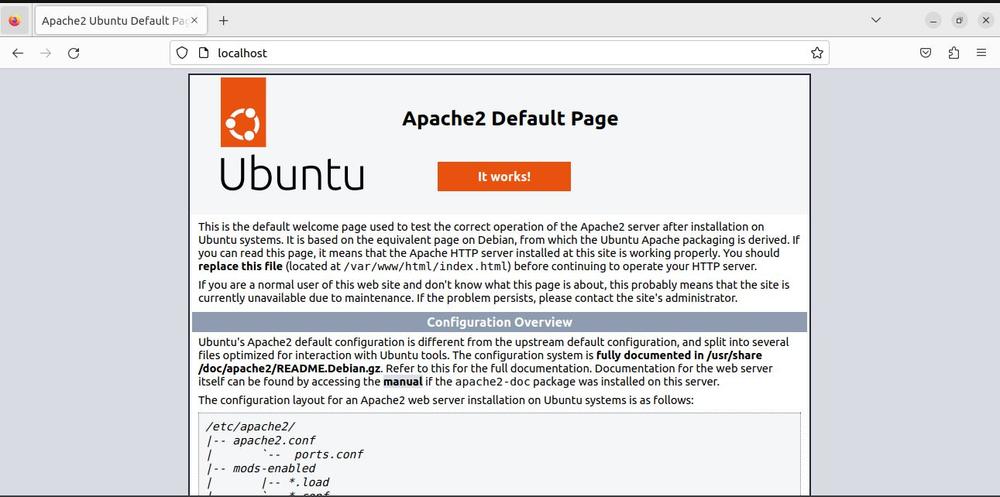
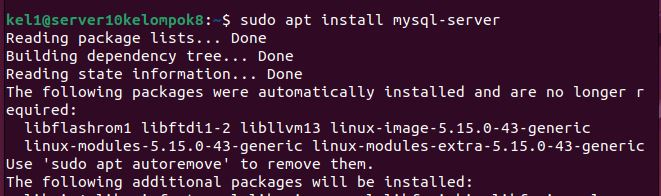
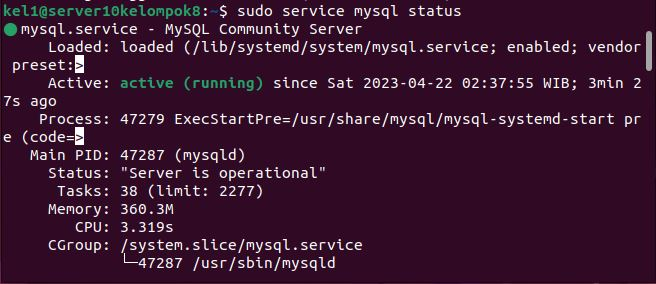
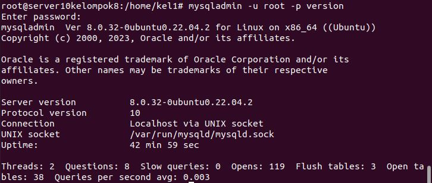
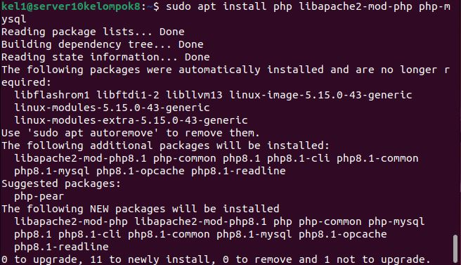
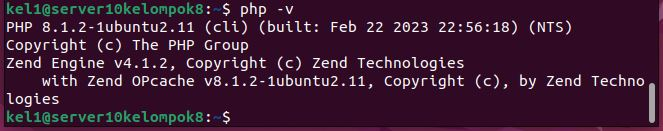
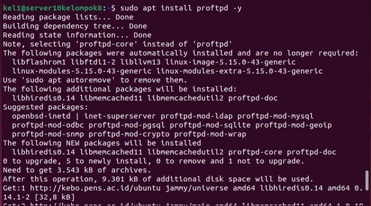

# Instalasi Web Server & FTP


## Anggota Kelompok:

- Muhammad Fajrul Falah Subakti (3121600035)
- Andriana Wahyu Hapsari (3121600040)
- Alan Tri Arbani Hidayat (3121600056)


## Instalasi Web Server (Apache)

Berikut adalah langkah-langkah instal Apache:

- Memperbarui paket yang tersedia ke versi terbaru: 

    ```
    sudo apt update
    ```

- Menginstal Apache dengan menjalankan perintah berikut: 

    ```
    sudo apt install apache2
    ```

    

Setelah instalasi selesai, Selanjutnya menyesuaikan pengaturan firewall untuk menginsinkan akses dari luar ke port web default.

- Melihat list dari ufw application yang tersedia:

    ```
    sudo ufw app list
    ```
    
    

- Untuk mengizinkan apache diakses dari jaringan public yakni port 80 untuk HTTP, menjalankan perintah:

    ```
    sudo ufw allow in 'Apache'
    ```

- Setelah instalasi apache dan konfigurasi firewall pada langkah sebelumnya, selanjutnya mengecek status dari apache dengan perintah dibawah ini.

    ```
    sudo systemctl status apache2
    ```
    
    

- Untuk memastikan berjalan dengan cara mengakses alamat IP dari server atau komputer yang terinstal Apache
    
    


## Instalasi MySQL

Pada Ubuntu 22.04 MySQL 8 sudah dimasukan sebagai versi default di repositori Jammy Jellyfish (nama ubuntu 22.04). Berikut cara melakukan instalasi MySQL.

- Melakukan instalasi MySQL dengan perintah:

    ```
    sudo apt install mysql-server
    ```

    

- Setelah proses instalasi selesai, kemudian cek status apakah MySQL sudah berjalan dengan perintah:

    ```
    sudo service mysql status
    ```

    

- Untuk melihat versi MySQL :

    ```
    mysqladmin -u root -p version
    ```

    


## Instalasi PHP

- Menginstal PHP, modul Apache PHP serta menggunakan MySQL dengan PHP menjalankan perintah:

    ```
    sudo apt install php libapache2-mod-php php-mysql
    ```

    

- Setelah instalasi selesai, jalankan perintah berikut untuk mengonfirmasi versi PHP

    ```
    php -v
    ```

    

## Instalasi FTP Server (PROFTPD)
- Melakukan instalasi PROFTPD:

    ```
    sudo apt install proftpd -y
    ```

    

- Memulai layanan dan mengaktifkan proftpd dengan perintah:

    ```
    sudo systemctl start proftpd
    sudo systemctl enable proftpd
    ```

- Cek status apakah sudah berjalan:

    ```
    sudo systemctl status proftpd
    ```

    


    
    