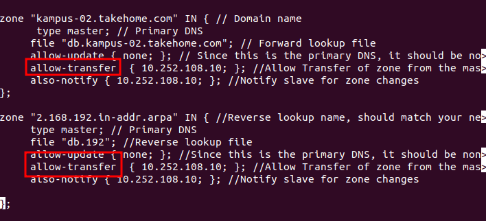
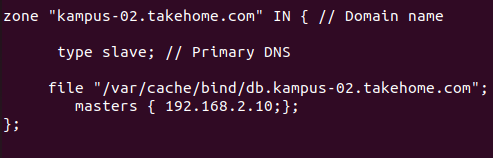
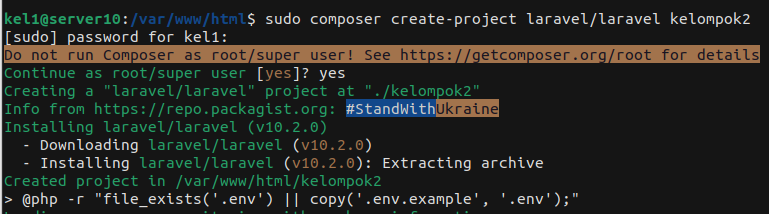
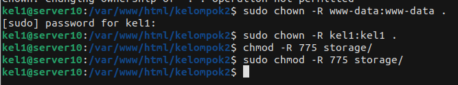

# 🚀 Tugas Kelompok Laravel & DNS Slave/Master


<p align = center>
LAPORAN RESMI <br>
WORKSHOP ADMINISTRASI JARINGAN </br>

<p align = center>
Dosen Pengampu <br>
Dr. Ferry Astika Saputra ST, M.Sc<br><br>

<p align = center>
Disusun Oleh<br>
Muhammad Fajrul Falah Subakti3121600035<br>
Andriana Wahyu Hapsari3121600040<br>
Alan Tri Arbani Hidayat 3121600056<br>
2 D4 IT B<br><br>


### **Config DNS Master**
#
- Buka konfigurasi zone dns
    `sudo nano /etc/bind/named.conf.local`
- tambahkan `allow-transfer { 10.252.108.10;};` didalam baris zone forward & reverse
    
- jangan lupa untuk restart service dns master
    ```
    sudo systemctl reload named
    ```
    
### **Config DNS Slave**
#
-  Buka direktori `/etc/bind/named.conf.default-zones` untuk konfigurasi DNS slave
    
- jangan lupa untuk restart service dns master
    ```
    sudo systemctl reload named
    ```
- untuk melihat apakah slave berhasil transfer zone masternya gunakan command berikut
    ```
    sudo grep "transfer" /var/log/syslog
    ```
- maka akan keluar output berikut jika berhasil transfer `transfer status : success`
    

- cara lain untuk memastikan bahwa berhasil terhubung adalah dengan mengecek di direktori `/var/cache/bind` terdapat file zone masters
    

### **Install Composer**
#
- karena sudah menginstall apache, php, dan mysql maka langsung menginstall composernya & laravel saja
- install composer
    ```
    curl -sS https://getcomposer.org/installer | php -- --install-dir=/usr/bin --filename=composer
    ```
- cek apakah composer sudah terinstall
    ```
    composer
    ```
- jika berhasil akan keluar output seperti berikut
    

### **Install Laravel**
#
- pindah ke direktori `/var/www/html/` sebagi direktori project laravel
- Buat project laravel
    ```
    composer create-project laravel/laravel kelompok2
    ```
    
- ubah permission direktori project
    ```
    chown -R kel1:kel1 .
    chmod -R 775 storage/
    ```
    

- testing jalankan project laravel dengan port 8000
    ```
    php artisan serve --host 192.168.2.21 --port 8000
    ```
- coba di pc client apakah laravel sudah berjalan dan dapat dibuka
    ```
    192.168.2.21
    ```
    