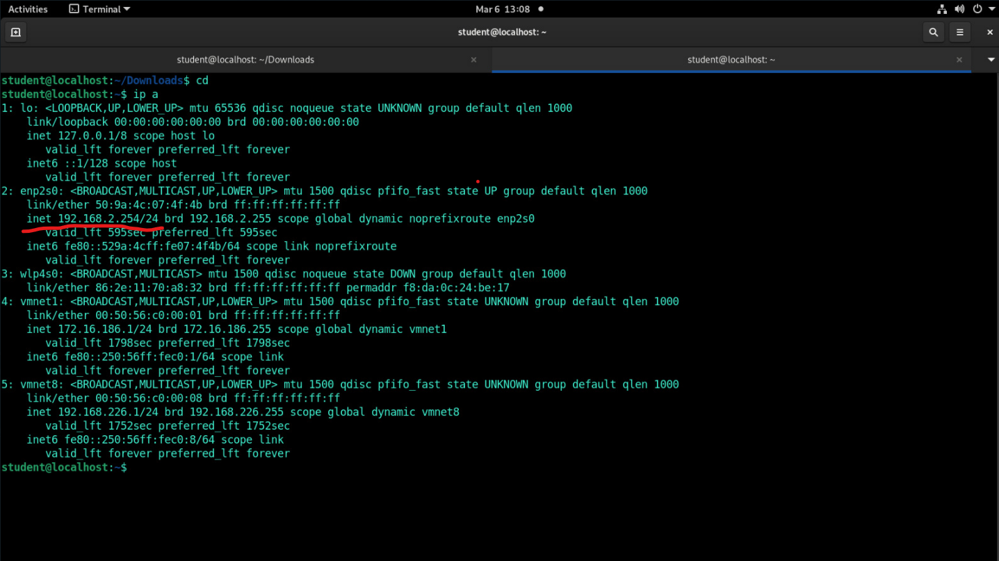
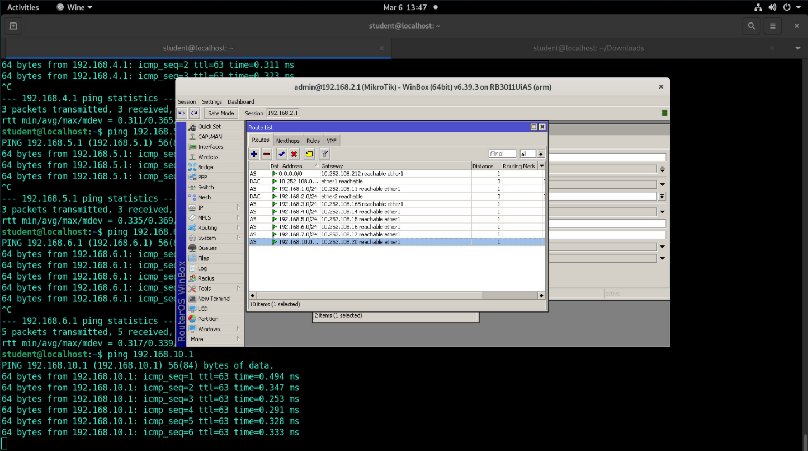
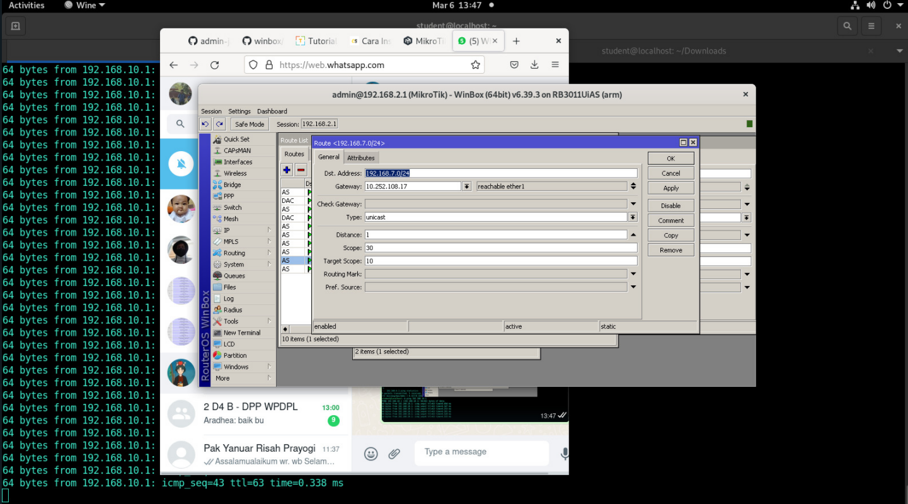
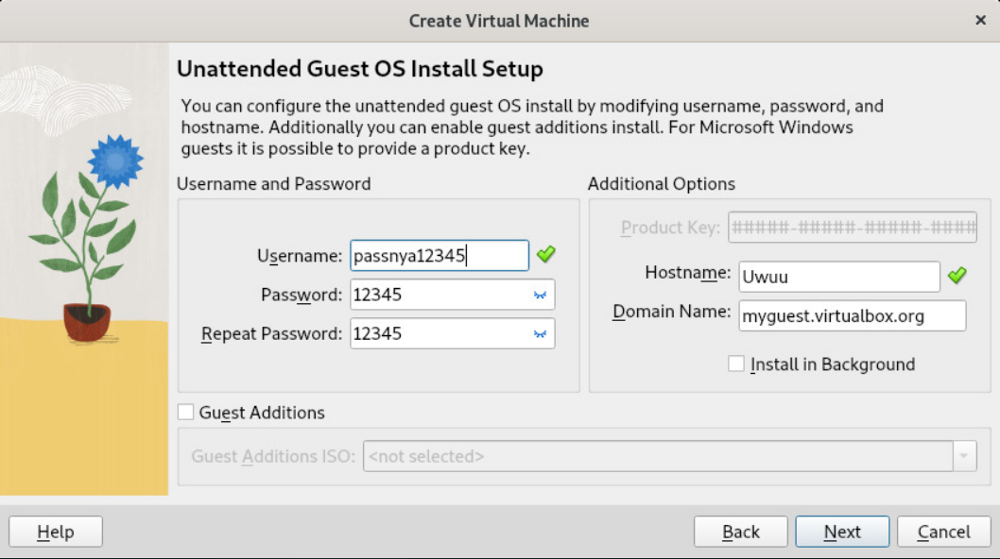
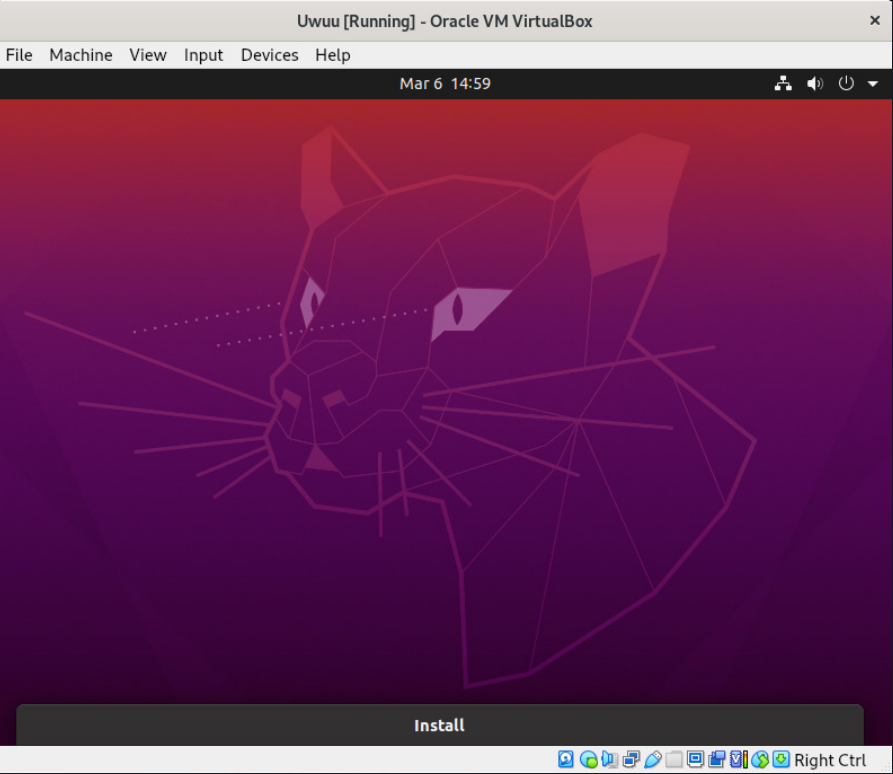

## IP Address PC


IP PC didapatkan dari command: ```ip a```\
IP : 192.168.2.254

---

## Akses Winbox dengan menggunakan Wine pada linux

Langkah-langkah:
1. Pastikan Wine telah terinstall di komputer
2. Download winbox64.exe pada website resmi, lalu letakkan pada folder di PC
3. Buka direktori tempat winbox64.exe berada, lalu jalankan perintah:
```
wine winbox64.exe
```
Tampilan winbox:\


Setelah winbox berhasil dibuka, sambungkan semua PC yang ada di lab. Setting routing dilakukan pada tiap PC. Prosesnya digambarkan pada gambar di bawah:\


Setelah tersambung, lakukan testing dengan ping ke network address pc yang akan dituju.

---

## Install VirtualBox di Debian

Untuk Sid, VirtualBox tersedia pada bagian "contrib" pada Debian, hanya untuk arsitektur amd64, sedangkan tambahan guest ada pada bagian "non-free" pada Debian. Berikut merupakan langkah-langkah untuk menginstall VirtualBox di Debian:

1. Tambahkan komponen "contrib" dan "non-free" ke /etc/apt/sources.list, sebagai contoh:
```
# Debian Unstable "Sid"
deb http://deb.debian.org/debian/ sid main contrib non free
```
2. Perbarui daftar paket yang tersedia:
```
sudo apt update
```
3. Install paket VirtualBox
```
sudo apt install virtualbox
```
4. Secara opsional, instal paket ekstensi dengan:
```
sudo apt install virtualbox-ext-pack
```
5. VirtualBox sudah terinstall dan berada pada menu Debian. Proses terakhir adalah melakukan instalasi ke dalam VirtualBox.

Tampilan install ubuntu dengan VirtualBox:\


Ubuntu sukses dijalankan:\

