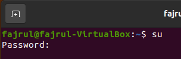
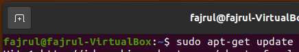

EVOLUSI OS:
Evolusi OS (Operating System) adalah proses perubahan yang terjadi pada sistem operasi dari waktu ke waktu. OS adalah perangkat lunak yang mengelola sumber daya komputer dan memungkinkan interaksi antara pengguna dan perangkat keras komputer. Evolusi OS terjadi karena adanya perubahan dalam teknologi komputer dan kebutuhan pengguna.

Sejak diciptakannya komputer pertama pada tahun 1940-an, OS telah mengalami banyak perubahan. Pada awalnya, OS hanya dapat digunakan oleh para ahli komputer dan sangat terbatas dalam fungsinya. Namun, dengan perkembangan teknologi, OS menjadi lebih kompleks dan dapat digunakan oleh banyak orang dengan berbagai kebutuhan.

Pada tahun 1960-an, OS pertama yang digunakan pada mainframe komputer muncul. OS ini dikenal sebagai batch processing system, yang berarti program-program harus dikelompokkan dan dijalankan secara bersamaan. Kemudian, OS timesharing diperkenalkan, yang memungkinkan beberapa pengguna untuk menggunakan komputer secara bersamaan.

Pada tahun 1980-an, munculah OS desktop pertama, seperti MS-DOS dan Mac OS. Kemudian, OS Windows yang populer diluncurkan pada tahun 1990-an. OS ini memiliki antarmuka pengguna yang lebih ramah dan mudah digunakan.

Dalam dekade terakhir, OS telah berkembang dengan cepat dan terus mengalami perubahan besar. Salah satu perubahan besar adalah munculnya OS mobile, seperti Android dan iOS, yang dibuat khusus untuk perangkat seluler seperti smartphone dan tablet. OS juga semakin terintegrasi dengan cloud computing dan teknologi lainnya, sehingga pengguna dapat mengakses data mereka dari mana saja dan kapan saja.

Dalam kesimpulannya, evolusi OS terus berlanjut seiring dengan kemajuan teknologi. OS terbaru mampu memberikan pengalaman yang lebih mudah, cepat, dan aman bagi pengguna dan memungkinkan komputer dan perangkat seluler menjadi lebih terkoneksi dan terintegrasi dengan dunia digital.

Perintah Su dan Sudo:

Perintah su dan sudo adalah perintah yang digunakan pada sistem operasi Linux dan Unix untuk memperoleh hak akses superuser atau root.

Perintah su singkatan dari "switch user" dan digunakan untuk mengalihkan identitas pengguna saat ini menjadi pengguna lain. Dalam kebanyakan distribusi Linux, ketika menjalankan perintah su, kita akan diminta untuk memasukkan password root. Setelah berhasil diotentikasi sebagai root, kita akan memiliki hak akses penuh pada sistem dan bisa melakukan perintah apa saja yang diizinkan oleh sistem.

Contoh penggunaan perintah su adalah:

Perintah sudo singkatan dari "superuser do" dan memungkinkan pengguna untuk menjalankan perintah tertentu dengan hak akses superuser tanpa harus masuk sebagai pengguna root secara penuh. Ketika menjalankan perintah dengan sudo, pengguna akan diminta untuk memasukkan password pengguna mereka sendiri, bukan password root.

Contoh penggunaan perintah sudo adalah:

Perintah di atas memungkinkan pengguna untuk menjalankan perintah apt-get update dengan hak akses superuser tanpa harus masuk sebagai root.

Perbedaan utama antara su dan sudo adalah bahwa su memungkinkan pengguna untuk beralih ke akun root sepenuhnya, sedangkan sudo memberikan hak akses superuser pada perintah tertentu saja. Penggunaan sudo lebih disarankan karena lebih aman dan mengurangi risiko penggunaan yang salah dan tidak sengaja melakukan perintah yang merusak sistem.
